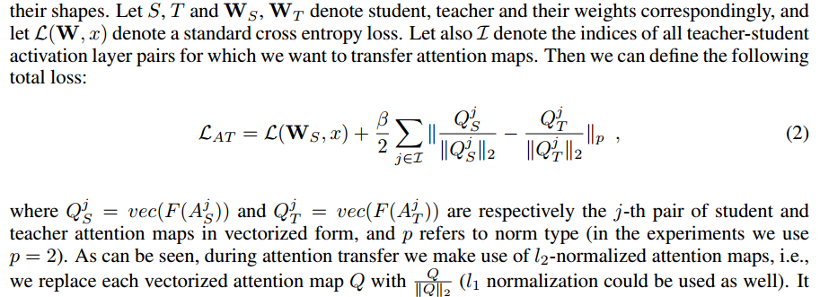

# Knowledge Distillation for Image Classification
Teacher-Student Mechanism to compress model & improve compact models
 

## Loss functions & Details
Standard Cross-entropy Loss between true targets y<sub>k</sub> and the network's outputs p<sub>k</sub><br>


### 1. Knowledge Distillation <sup>[1]</sup>
######Use soft label produced by teacher model to direct student model.<br>

Softmax output layer converts the logit *z<sub>i</sub>* computed for each class into a probability, *q<sub>i</sub>*,
by comparing *z<sub>i</sub>* with the other logits.<br>
 <br>
```
where
* T: temperature, the higher temperature is, the softer probability distribution is;
* z: network's output logits; 
```
Notes: 
* If teacher model is the result of an ensemble, either *z* or *q* are obtained by averaging outputs of models.

* If correct labels are known for all or some of the transfer set, use a weighted average of two different 
objective functions.
  1. cross entropy loss with the soft targets 
  2. cross entropy loss with the correct labels
  3. Empirically,
  * Best results obtained by using a lower weight of second loss; 
  * It's important to multiply 1<sup>st</sup> loss by T<sup>2</sup> when using both the two losses.

#### Total loss function: <br>


#### **Experiments on CIFAR:** <br>
|Method |Setting                                                    |
| ----- | --------------------------------------------------------- |
|KD     |*T* = 4, *α* = 0.9                                     |


### 2. FitNets<sup>[2]</sup>
###### Compress *wide & shallow* networks into *narrow & deep* networks
###### Introduce *intermediate-level* hints to guide student
#### 2.1 Definitions
|             |                                                                       |
| ----------- | --------------------------------------------------------------------- |
|Hint         |Output of teacher's hidden layer; responsible for guiding student      |
|Hint Layer   |The hidden layer in teacher model                                      |
|Guided Layer |The chosen hidden layer in student model                               |
|Regressor    |Add to guided layer, outputs matches the size of hint layer            |
* The deeper the guided layer is , the less flexibility the network has, the more possibly the model get over-regularization. 
#### 2.2 Stage-wise Training
1. Stage I: Pre-train student network up to guided layer, based on the prediction error of the teacher's hint layer

2. Stage II: KD training of the whole network

<br>
#### **Experiments on CIFAR:** <br>
|Method              |Setting                                                    |
| ------------------ | --------------------------------------------------------- |
|KD                  |*T* = 4, *α* = 0.9                                         |
|FitNet (Maxout Net) |


### 3. Attention Transfer <sup>[3]</sup>
**Feature map** *R<sup> CxHxW</sup>* --> **Attention map** *R<sup> HxW</sup>*

#### 3.1. Activation-based attention maps


Attention Transfer  Losses Definition:


<br>
#### **Experiments on CIFAR:** <br>
|Method     |Setting                                                    |
| --------- | --------------------------------------------------------- |
|KD         |*T* = 4, *α* = 0.9                                         |
|AT (WRN)   |* Mapping Function: use sum of squared attention;          |
|           |* *β*: varies about 0.1. (10<sup>3</sup>/(H * W * N))     |
|           |* Decay *β* when using combining AT with KD               |
 

#### 3.2. Gradient-based attention maps


### 4. Neural Selectivity Transfer <sup>[4]</sup>


### 5. Flow of Solution Procedure <sup>[5]</sup>


## Training Scripts
Please see the [Training recipes](TRAINING.md) for how to train the models.


## Results
#### CIFAR
Top1 error rate on the CIFAR-10/100 benchmarks are reported. You may get different results when training your models with different random seed.
Note that the number of parameters are computed on the CIFAR-10 dataset.\
```Top-1 Accuracy is the best one, while Top-5 is one at the last epoch.```

| Model             | Param (M)      | CIFAR-10 Top1 (%) | CIFAR-10 Top5 (%) |
| ----------------- | -------------- | ----------------- | ----------------- |
| ResNet-20         | 0.27           | 91.70             | 99.71             |
| ResNet-32         | 0.47           | 92.93             | 99.73             |
| ResNet-44         | 0.66           | 93.32             | 99.76             |
| ResNet-56         | 0.86           | 93.63             | 99.75             |
| ResNet-110        | 1.73           | 93.77             | 99.78             |

| Model             | Param (M)      | CIFAR-100 Top1 (%) | CIFAR-100 Top5 (%) |
| ----------------- | -------------- | ------------------ | ------------------ |
| ResNet-20         | 0.28           | 67.86              | 90.11              |
| ResNet-32         | 0.47           | 69.96              | 90.81              |
| ResNet-44         | 0.67           | 70.56              | 91.33              |
| ResNet-56         | 0.86           | 71.09              | 91.56              |
| ResNet-110        | 1.74           | 71.85              | 91.36              |


## Supported Algorithms
* [x] [1] Knowledge Distillation (KD): [Distilling the Knowledge in a Neural Network](https://arxiv.org/abs/1503.02531v1)
* [ ] [2] FitNets: [FitNets: Hints for Thin Deep Nets](https://arxiv.org/abs/1412.6550)
* [x] [3] Attenion Transfer (AT): [Paying More Attention to Attention: Improving the Performance of 
Convolutional Neural Networks via Attention Transfer](https://arxiv.org/abs/1612.03928v3) 
* [x] [4] Neural Selectivity Transfer (NST): [Like What You Like: Knowledge Distill via Neuron Selectivity Transfer](https://arxiv.org/abs/1707.01219)
* [x] [5] Flow of Solution Procedure (FSP): [A Gift From Knowledge Distillation: Fast Optimization, 
Network Minimization and Transfer Learning](https://zpascal.net/cvpr2017/Yim_A_Gift_From_CVPR_2017_paper.pdf)
